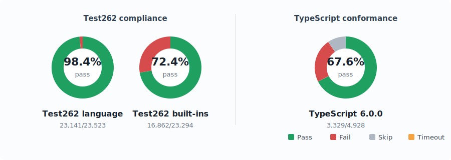

[](https://deepwiki.com/nooga/paserati)

## PASERATI


### _"Sir, it's no V8 but we're doing what we can"_

Paserati is an **experimental (mad scientist kind of experimental) TypeScript runtime**: it parses + type-checks TypeScript and compiles it **directly to bytecode** for a register VM. And then it executes the bytecode.

TypeScript is a superset of JavaScript, so if you can execute TypeScript, you’re building an **ECMAScript 2025** runtime too.

### What’s under the hood

Under the hood: **TS/JS → bytecode → register VM**, with **inline caches**, **shape-based objects** (a.k.a. "hidden classes"), and a pluggable async executor with **microtask scheduling**.

Right now it prioritizes **correctness** over raw speed, but the architecture is designed for type-driven optimization later (specialization, monomorphization, unchecked fast paths).

### Wins

- **Test262 language suite: 98.2%**, **built-ins: 72.4%**, **TypeScript 6.0.0 conformance: 67.0%** (see details below)
- **Native TS execution**: no `tsc`, no TS→JS transpilation
- **TCO**: tail call optimization (elite feature)
- **Shapes + ICs**: fast-ish property access without a JIT
- **Runtime type reflection**: `Paserati.reflect<T>()` (generate a type object / JSON Schema at runtime)
- **Small-ish footprint**:
  - **~16MB static binary** (unstripped, includes lexer/parser/checker/compiler/VM/builtins)
  - **~5MB BSS idle** (approx; depends on build/OS)
  - **Pure Go**, no CGO, no WASM blobs, **two simple dependencies** (`golang.org/x/text`, `github.com/dlclark/regexp2`)

### Weird flex but okay benchmarks

Paserati has a long way to go performance-wise, but it’s already at the point where it can **beat [dop251/goja](https://github.com/dop251/goja)** and **QJS** on a couple of simple microbenches.

Results from `hyperfine` (see `bench/hyperfine.sh`):

| Benchmark          | paserati (Mean) |     goja (Mean) |       QJS(Mean) |                                                            Relative |
| :----------------- | --------------: | --------------: | --------------: | ------------------------------------------------------------------: |
| `bench/bench.js`   | 3.924 ± 0.097 s | 5.207 ± 0.093 s | 4.945 ± 0.092 s | **paserati 1.33× faster than gojac**, **1.26× faster than quickjs** |
| `bench/objects.js` | 6.169 ± 0.092 s | 7.015 ± 0.151 s | 8.135 ± 0.130 s | **paserati 1.14× faster than gojac**, **1.32× faster than quickjs** |

Paserati also [runs V8 benchmarks](<https://ahaoboy.github.io/js-engine-benchmark/?kind=Time(s)&selectEngines=goja,paserati&sort=Time(s)>), beating Goja in several.

If your favorite pure Go JavaScript engine is reading this: _skill issue_.

### Examples

- **Runtime type reflection / JSON Schema**: `examples/reflect.ts`
- **Proxy + classes + async**: `examples/reactive.ts`
- **Async/await + generators**: `examples/async.ts`
- **Classes (private fields, inheritance, statics)**: `examples/classes.ts`
- **Typed recursion (Y combinator)**: `examples/ycomb.ts`
- **“Look ma, generics”**: `examples/generics.ts`

Examples may or may not work at every commit, but they should work at least once in a while.

### What it isn’t (non-goals)

- **A TypeScript build toolchain replacement**: see [microsoft/typescript-go](https://github.com/microsoft/typescript-go)
- **A JIT in Go**: I’ll stop just short of that (for now)
- **Perfect “legacy weirdness”**: modern ES is the target; some dusty corners (like `with`) are still incomplete

### Usage

```bash
# Build
go build -o paserati ./cmd/paserati/

# Run the REPL
./paserati

# Run a snippet
./paserati -e 'console.log("hello from paserati")'

# Execute a script
./paserati path/to/script.ts

# Run the test suite
go test ./tests/...
```

### Compliance snapshot

<!-- compliance:begin -->


| Suite | Passed | Failed | Skipped | Timeouts | Pass rate |
| :-- | --: | --: | --: | --: | --: |
| Test262 language | 23,093/23,523 | 430 | 0 | 0 | 98.2% |
| Test262 built-ins | 16,857/23,294 | 6,437 | 0 | 0 | 72.4% |
| TypeScript 6.0.0 conformance | 3,302/4,928 | 1,153 | 473 | 0 | 67.0% |
<!-- compliance:end -->

The Test262 language and built-ins figures come from the local baseline snapshots for the checked-out ECMA-262 conformance tests. The TypeScript figure comes from the single-file conformance runner against the TypeScript 6.0.0 test suite.

### Current status

At **98.2% Test262 language compliance** and **67.0% TypeScript 6.0.0 conformance**, Paserati handles a large chunk of modern JavaScript/TypeScript semantics correctly. It's still evolving, but it's past the "toy project" phase.

Core language features that work well:

- **Async/await, TLA, Promises, microtasks** (incl. top-level await, async generators)
- **ESM modules** (plus dynamic `import()`, pluggable resolution)
- **Classes** (private fields, statics, inheritance, super expressions, **decorators**)
- **(Async) Generators** (`yield`, `yield*`)
- **Modern operators** (`?.`, `??`, logical assignment)
- **Destructuring** (arrays/objects/rest/spread)
- **Built-ins** (Proxy/Reflect/Map/Set/TypedArrays/ArrayBuffer/RegExp/Symbol/BigInt)
- **Advanced types** (generics, conditional/mapped types, template literal types, `infer`)

It runs real-world TypeScript libraries like [date-fns](https://github.com/date-fns/date-fns) from source.

Remaining gaps:

- `import defer` (stage 3 proposal; mostly unimplemented)
- Some edge cases in `eval` and module namespaces
- Import attributes (experimental ES feature)

See [docs/bucketlist.md](docs/bucketlist.md) for the exhaustive yet messy feature inventory.

### Contributing

Seriously, why would you want to contribute to this? _…But if you do, I'm both terrified and thrilled. PRs and issues are welcome._

### License

This project is licensed under the MIT License.

### AI disclaimer

This is a **one-person** project developed in my **free time** with the help of **AI**. It is also an experiment in large scale software engineering with AI, aimed at speedrunning a production-quality open source project.

Google Gemini 2.5/3.0 Pro and Claude Sonnet/Opus 4/4.5/4.7 and GPT 5.5 wrote almost all the code so far under more or less careful direction and scrutiny - also known as "vibe coding but when you know what you're doing".

That fun sticker at the top of the README? It's made with GPT-4o's image generation.

---

_Remember: Pedal to the metal, or just pedal faster._
