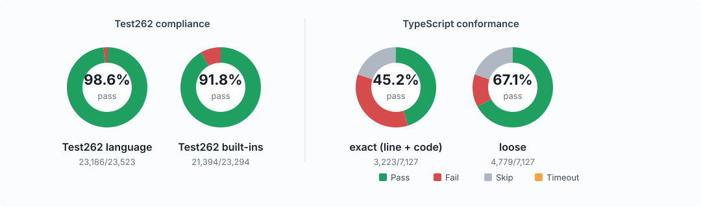

[](https://deepwiki.com/nooga/paserati)

## PASERATI


### _"Sir, it's no V8 but we're doing what we can"_

Paserati is an **experimental (mad scientist kind of experimental) TypeScript runtime**: it parses + type-checks TypeScript and compiles it **directly to bytecode** for a register VM. And then it executes the bytecode.

TypeScript is a superset of JavaScript, so if you can execute TypeScript, you're building an **ECMAScript 2025** runtime too.

### What's under the hood

**TS/JS → bytecode → register VM**, with **inline caches**, **shape-based objects** (a.k.a. "hidden classes"), and a pluggable async executor with **microtask scheduling**.

Right now it prioritizes **correctness** over raw speed, but the architecture is designed for type-driven optimization later (specialization, monomorphization, unchecked fast paths).

### Wins

- Test262 language suite: **98.6%**, built-ins: **91.8%**, TypeScript 6.0.3 conformance: **45.2%** exact / **67.1%** loose (see details below)
- **Native TS execution.** No `tsc`, no TS→JS transpilation step.
- **TCO.** Tail call optimization (elite feature).
- **Shapes + ICs.** Fast-ish property access without a JIT.
- **Runtime type reflection.** `Paserati.reflect<T>()` generates a type object or JSON Schema at runtime.
- **Small-ish footprint.**
  - **~26MB static binary** (unstripped; **~18MB** with `-ldflags "-s -w"`), including the lexer, parser, type checker, compiler, VM and builtins
  - **~21MB peak RSS** for `paserati -e '1'`, which starts in about 10ms
  - **Pure Go**, no CGO, no WASM blobs, **three small dependencies** (`golang.org/x/text`, `github.com/dlclark/regexp2`, `github.com/rivo/uniseg`)
  - Measured on Apple Silicon (arm64, macOS) with Go 1.27.1

### Weird flex but okay benchmarks

Paserati has a long way to go performance-wise, but it can already **beat [dop251/goja](https://github.com/dop251/goja)** and **[modernc.org/quickjs](https://gitlab.com/cznic/quickjs)** (QuickJS translated to pure Go) on a couple of simple microbenches. These are pure-Go peers; native engines such as V8 or C QuickJS are a different league.

Results from `hyperfine` (see `bench/hyperfine.sh`; Apple Silicon, October 2026; Paserati runs with `--no-typecheck`):

| Benchmark          | paserati (Mean) |     goja (Mean) | QuickJS/modernc (Mean) |                                                     Relative |
| :----------------- | --------------: | --------------: | ---------------------: | -----------------------------------------------------------: |
| `bench/bench.js`   | 2.404 ± 0.041 s | 5.175 ± 0.034 s |        4.905 ± 0.046 s | **paserati 2.15× faster than goja**, **2.04× faster than QuickJS** |
| `bench/objects.js` | 5.286 ± 0.036 s | 6.957 ± 0.052 s |        7.979 ± 0.041 s | **paserati 1.32× faster than goja**, **1.51× faster than QuickJS** |

Paserati also [runs V8 benchmarks](<https://ahaoboy.github.io/js-engine-benchmark/?kind=Time(s)&selectEngines=goja,paserati&sort=Time(s)>), beating Goja in several.

If your favorite pure Go JavaScript engine is reading this: _skill issue_.

### Examples

- **Runtime type reflection / JSON Schema**: `examples/reflect.ts`
- **Proxy + classes + async**: `examples/reactive.ts`
- **Async/await + generators**: `examples/async.ts`
- **Classes (private fields, inheritance, statics)**: `examples/classes.ts`
- **Typed recursion (Y combinator)**: `examples/ycomb.ts`
- **"Look ma, generics"**: `examples/generics.ts`

Examples may or may not work at every commit, but they should work at least once in a while.

### What it isn't (non-goals)

- **A TypeScript build toolchain replacement**: see [microsoft/typescript-go](https://github.com/microsoft/typescript-go)
- **A JIT in Go**: I'll stop just short of that (for now)
- **Perfect "legacy weirdness"**: modern ES is the target; some dusty corners (like `with`) are still incomplete

### Usage

```bash
# Build
go build -o paserati ./cmd/paserati/

# Run the REPL
./paserati

# Run a snippet
./paserati -e 'console.log("hello from paserati")'

# Execute a script
./paserati path/to/script.ts

# Run the test suite
go test ./tests/...
```

### Compliance snapshot

<!-- compliance:begin -->


| Suite | Passed | Failed | Skipped | Timeouts | Pass rate |
| :-- | --: | --: | --: | --: | --: |
| Test262 language | 23,186/23,523 | 337 | 0 | 0 | 98.6% |
| Test262 built-ins | 21,394/23,294 | 1,900 | 0 | 0 | 91.8% |
| TypeScript 6.0.3 conformance (exact) | 3,223/7,127 | 2,496 | 1,408 | 0 | 45.2% |
| TypeScript 6.0.3 conformance (loose) | 4,779/7,127 | 940 | 1,408 | 0 | 67.1% |
<!-- compliance:end -->

TypeScript figures cover every test in TypeScript 6.0.3's `tests/cases/conformance`, one entry per compiler-option variant the test declares. `exact` counts a test as passed only when Paserati reports the same diagnostics as `tsc`: the same TypeScript error codes on the same lines, nothing missing and nothing extra. `loose` only requires that we raised *some* error where one was expected, so it overcounts conformance. Skipped tests (multi-file and `.tsx`, not yet supported by the runner) count against the pass rate. Treat exact as the honest number.

The Test262 language and built-ins figures come from the local baseline snapshots for the checked-out ECMA-262 conformance tests. Since September 2026 (runner policy 2) a test counts as passed only if it passes in every required variant (sloppy and strict unless flagged otherwise), negative tests raise the declared error in the declared phase, and async tests report success through `$DONE`. Earlier figures, including the 98.1% language number, came from a runner that counted many of those as passes. The TypeScript figures come from `paserati-testtsc` run against the conformance suite of the TypeScript 6.0.3 release (tag `v6.0.3`), comparing Paserati's diagnostics with `tsc`'s reference baselines.

### Current status

At **98.6% Test262 language compliance** and **45.2% TypeScript 6.0.3 conformance** (exact diagnostics; 67.1% under the looser any-error-raised metric), Paserati handles a large chunk of modern JavaScript/TypeScript semantics correctly. It's still evolving, but it's past the "toy project" phase.

Core language features that work well:

- **Async/await, TLA, Promises, microtasks** (incl. top-level await, async generators)
- **ESM modules** (plus dynamic `import()`, pluggable resolution)
- **Classes** (private fields, statics, inheritance, super expressions, **decorators**)
- **(Async) Generators** (`yield`, `yield*`)
- **Modern operators** (`?.`, `??`, logical assignment)
- **Destructuring** (arrays/objects/rest/spread)
- **Built-ins** (Proxy/Reflect/Map/Set/TypedArrays/ArrayBuffer/RegExp/Symbol/BigInt)
- **Advanced types** (generics, conditional/mapped types, template literal types, `infer`)

It runs real-world TypeScript libraries like [date-fns](https://github.com/date-fns/date-fns) from source.

Remaining gaps:

- `import defer` (stage 3 proposal; mostly unimplemented)
- Some edge cases in `eval` and module namespaces
- Import attributes (experimental ES feature)

See [docs/bucketlist.md](docs/bucketlist.md) for the exhaustive yet messy feature inventory.

For an implementation plan covering compiler and VM correctness, Go memory
management, interpreter performance, and bounded development benchmarks, see the
[production runtime roadmap](docs/runtime-production-roadmap.md).

### Contributing

Seriously, why would you want to contribute to this? _…But if you do, I'm both terrified and thrilled. PRs and issues are welcome._

### License

This project is licensed under the MIT License.

### AI disclaimer

This is a **one-person** project developed in my **free time** with the help of **AI**. It is also an experiment in large scale software engineering with AI, aimed at speedrunning a production-quality open source project.

Google Gemini 2.5/3.0 Pro and Claude Sonnet/Opus 4/4.5/4.7 and GPT 5.5 wrote almost all the code so far under more or less careful direction and scrutiny. Call it vibe coding, but the kind where you know what you're doing.

That fun sticker at the top of the README? It's made with GPT-4o's image generation.

---

_Remember: Pedal to the metal, or just pedal faster._
